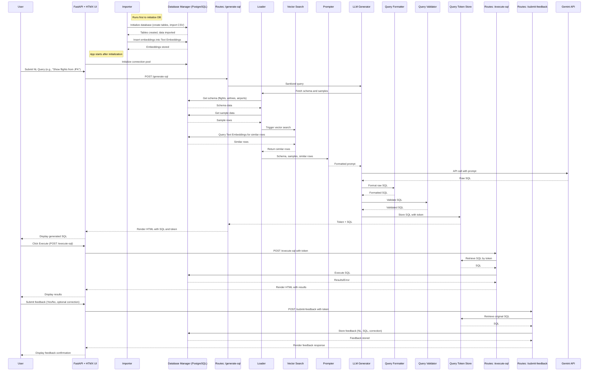

##TextQL

Natural language to SQL query translation pipeline with frontend.

**Features**

*   **Natural Language Processing**: Converts user queries (e.g., "Show flights from JFK") into SQL using Google’s Gemini API.
    
*   **Vector Search**: Enhances query generation with similar past queries via Sentence Transformers and pgvector.
    
*   **Asynchronous Database Access**: Uses asyncpg for efficient PostgreSQL interactions with a 10-second query timeout.
    
*   **Interactive UI**: HTMX-driven frontend with Jinja2 templates for real-time query execution and feedback.
    
*   **Rate Limiting**: Limits API requests (e.g., 1 per 15 seconds) using slowapi.
    
*   **Feedback Loop**: Allows users to submit corrections, stored in the database for future improvements.
    
*   **Configurable**: Non-sensitive settings in textql.yaml, secrets in .env.

Data flows from natural language input to SQL generation, execution, and feedback storage, leveraging embeddings for context.

**Architecture**

**Prerequisites**

*   **Python**: 3.9+
    
*   **PostgreSQL**: 13+ with pgvector extension
    
*   **Dependencies**: Listed in requirements.txt
    
*   **Google Gemini API Key**: For LLM integration
    

**Installation**

1.  clone https://github.com/chauchausoup/textql.git

2.  copy .env file
    
3.  docker-compose up --build -d

4.  ./init.sh

**Usage**

1.  **Visit the Root Page**: Open http://127.0.0.1:8000 to see the TextQL interface.
    
2.  **Generate SQL**:
    
    *   Enter a natural language query (e.g., "Show flights from JFK").
        
    *   Submit via the form (POST /generate-sql).
        
    *   View the generated SQL query.
        
3.  **Execute SQL**:
    
    *   Click "Execute Query" (POST /execute-sql using the query\_token).
        
    *   See results in a table.
        
4.  **Submit Feedback**:
    
    *   Approve ("Yes") or correct ("No") the query (POST /submit-feedback).
        
    *   Provide a corrected SQL query if needed.
        

**API Endpoints**While primarily a web app, the endpoints are accessible:

*   **GET /**: Root page (HTML).
    
*   **POST /generate-sql**: Generates SQL from natural language input.
    
    *   **Body**: natural\_language\_input (form-data).
        
    *   **Response**: HTML with SQL and token.
        
*   **POST /execute-sql**: Executes a generated SQL query.
    
    *   **Body**: query\_token (form-data).
        
    *   **Response**: HTML with results or error.
        
*   **POST /submit-feedback**: Submits feedback on a query.
    
    *   **Body**: query\_token, feedback, corrected\_sql (optional, form-data).
        
    *   **Response**: HTML with feedback result.
        

**Rate Limits**:

*   /generate-sql, /execute-sql: 1 request per 15 seconds.
    
*   /submit-feedback: 1 request per 5 seconds.

